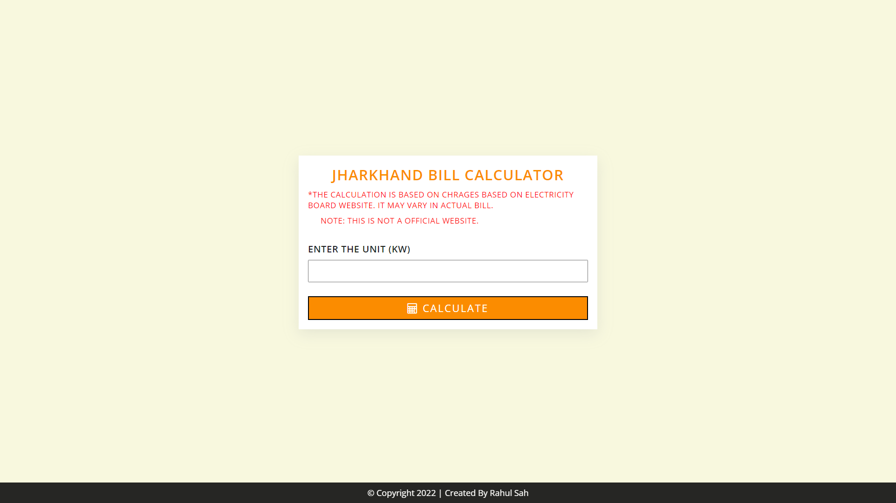
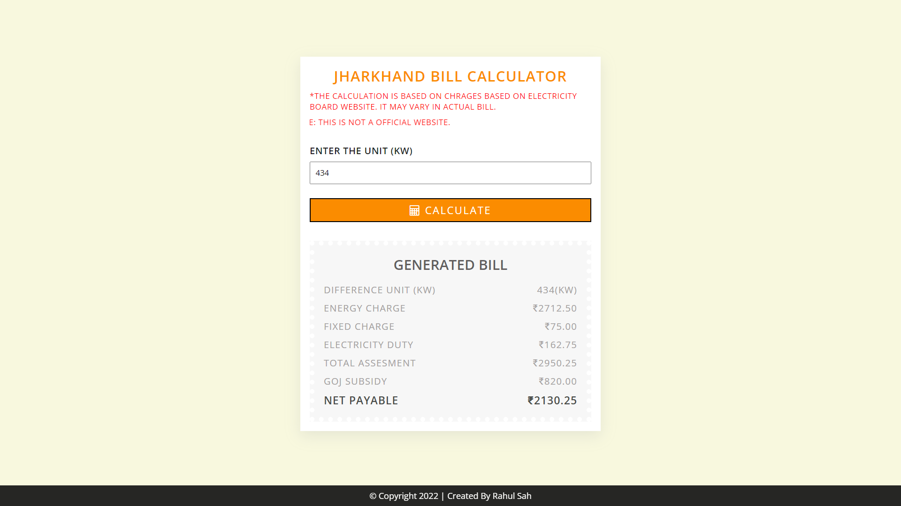

<h1>Jharkhand Electricity Bill Calculator</h1>
<h3>Calculate your monthly bill by entering the unit used <a href="https://rahulsahofficial.github.io/jharkhand-electricity-calculator/" target="black">Click to Open</a></h3>

<h4>Calculator Preview</h4>
<h5>Input Screen</h5>

<h5>Calculated Bill Screen</h5>

